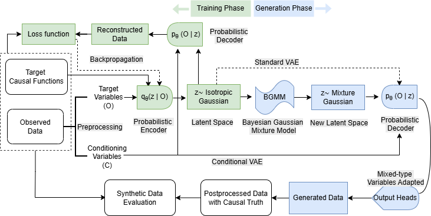

# CausalMix

[](https://arxiv.org/abs/2603.03587)

**CausalMix** is a variational generative framework for causal inference. Because individual causal effects are unobservable, method evaluation and study design in causal inference rely on synthetic data with known counterfactuals. CausalMix provides a calibrated sandbox that generates realistic mixed-type tabular data while enabling explicit control over treatment effects, confounding, and overlap via a conditional VAE with a Gaussian mixture latent prior. 

This supports principled estimator benchmarking, hyperparameter tuning, and simulation-based study design under data-generating processes that resemble real-world structure while preserving access to causal truth.

---

## Framework Overview



*Figure: High-level architecture of the CausalMix framework. The generator models multimodal dependencies in mixed-type tabular data while preserving explicit causal structure, enabling controllable data generation and downstream evaluation.*

---

## Repository Structure

```
causalmix/
│
├── src/causalmix/           # Core library (importable package)
│   ├── core/                # CausalMix model
│   ├── models/              # conVAE
│   ├── data/                # preprocessing & schema
│   ├── eval/                # evaluation utilities
│   ├── cate/                # CATE estimators & benchmarking
│   ├── reporting/           # table builders
│   └── viz/                 # plotting helpers
│
├── notebooks/
│   ├── examples/            # Minimal usage examples
│   ├── CausalMix_validate/  # Generator validation experiments
│   ├── cate/                # Estimator benchmarking & applications
│   └── paper/               # Tables and figures for manuscript
│
├── data/
│   ├── demo/                # Small public demo datasets
│   ├── private/             # Confidential data (not committed)
│   └── synth_data/          # Synthetic datasets used in experiments
│
├── results/                 # Generated outputs (tables/figures)
│
├── images/                 # Additional images used in the README.md
│
├── requirements.txt
├── README.md
└── .gitignore
```

---

## Installation

### 1. Clone the repository

```bash
git clone https://github.com/zhangqiecho/causalmix.git
cd causalmix
```

### 2. Install Python dependencies (pip)

```bash
pip install -r requirements.txt
pip install -e .
```

Optional (conda):

```bash
conda create -n causalmix python=3.10
conda activate causalmix
pip install -r requirements.txt
pip install -e .
```

---

## Optional: R-based Estimators (BCF, GRF)

Some CATE estimators rely on R packages accessed via `rpy2`.

Requirements:
- R (>= 4.0)
- Python package: `rpy2`
- CRAN packages: `bcf`, `grf`

Install CRAN packages in R:

```r
install.packages(c("bcf", "grf"), repos = "https://cloud.r-project.org")
```

Verify in Python:

```python
from rpy2.robjects.packages import importr
importr("bcf")
importr("grf")
```

These estimators are optional. The rest of the repository runs without R.

---

## Quick Start

### Standalone conVAE (tabular generator)

Notebook: [conVAE example](notebooks/examples/convae_example.ipynb)

Demonstrates:
- Simulating a toy causal dataset with mixed-type covariates
- Training **conVAE** as a standalone tabular generator
- Sampling synthetic data senquentially
- Comparing real vs synthetic distributions

---

### Full CausalMix Pipeline

Notebook: [CausalMix example](notebooks/examples/causalmix_example.ipynb)

Demonstrates:
- Simulating a toy causal dataset with mixed-type covariates
- Fitting CausalMix
- Generating synthetic data with (X, T, Y)
- Running distributional and causal validation with privacy metrics

---

## Validation Experiments (paper generator validation)

Located under:

```
notebooks/CausalMix_validate/
```

Run in order:

1. `01_setup_data.ipynb`
2. Remaining scenario notebooks

For each scenario, we evaluate:
- Distributional fidelity
- Causal structure
- Privacy

---

## CATE Benchmarking & Applications

Located under:

```
notebooks/cate/
```

Includes:

- Single-dataset sanity check
- Estimator comparison (Application 1)
- Hyperparameter tuning (Application 2)
- Power analysis (Application 3)

---

## Data Policy

- Private datasets are **not included**.
- Place confidential data under:
  ```
  data/private/
  ```
- Public demo datasets belong under:
  ```
  data/demo/
  ```

Demo datasets illustrate usage and do **not** reproduce the empirical results in the paper.

---

## Reproducibility Notes

- Run notebooks from the repository root(recommended).
- Paths are managed via `notebooks/set_up.py`.
- Outputs are saved under `results/`.

<!-- --- -->

<!-- ## Citation

If you use this repository, please cite:

```
@article{causalmix2026,
  title={Controllable Generative Sandbox for Causal Inference},
  author={...},
  year={2026}
}
``` -->

---

## License

This project is licensed under the Apache-2.0 License.
